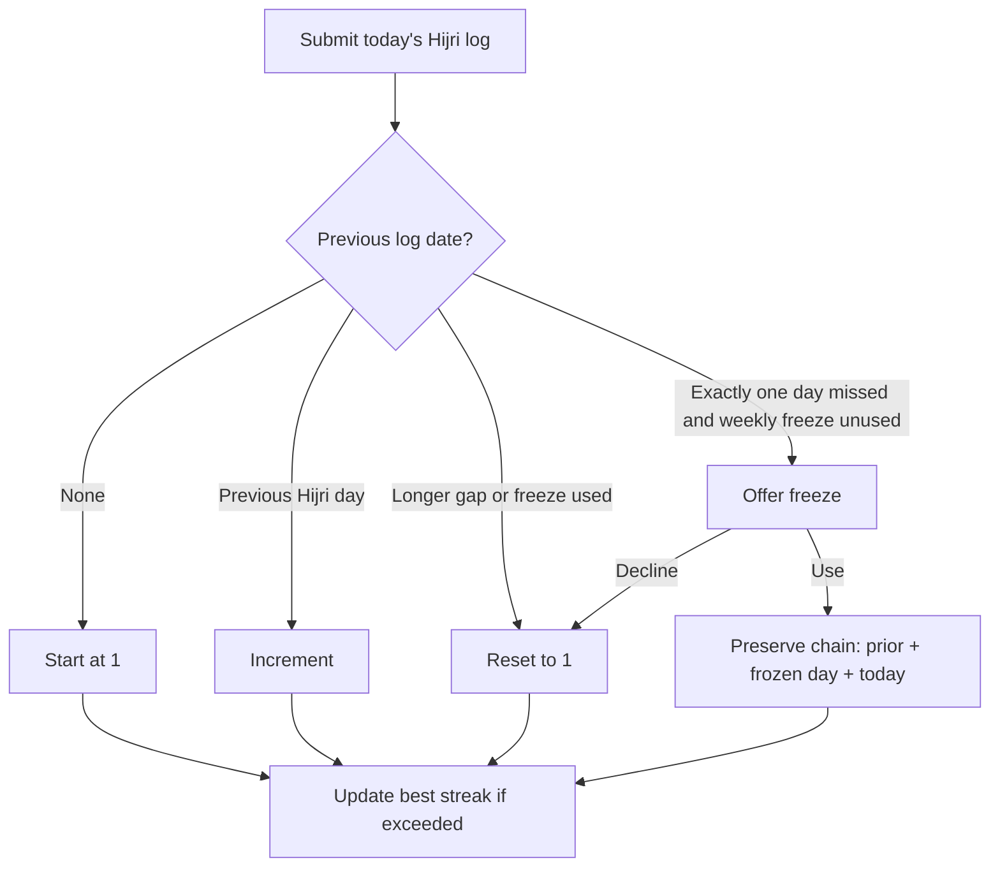
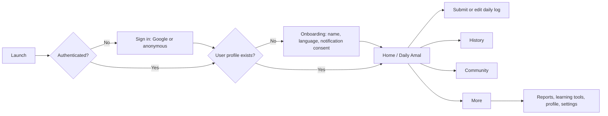
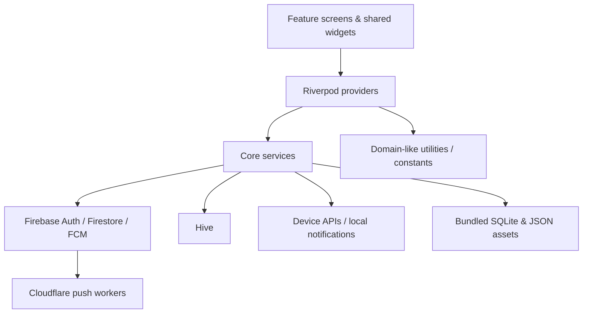

# Amol Tracker

> **Project reference / single source of truth**
> Last verified against the repository: 2 August 2026 · App version: `1.0.0+15`

Amol Tracker is a Flutter application for building consistent daily Islamic worship habits (_amal_) through a private daily log, a Hijri/Maghrib-aware day boundary, gentle reminders, learning tools, and opt-in community accountability.

## Table of contents

- [Project overview](#project-overview)
- [Technology stack](#technology-stack)
- [Feature catalogue](#feature-catalogue)
- [Amal fields](#amal-fields)
- [Point system and streaks](#point-system-and-streaks)
- [User journey](#user-journey)
- [Screens and navigation](#screens-and-navigation)
- [Architecture](#architecture)
- [Data and Firestore](#data-and-firestore)
- [Authentication](#authentication)
- [Notifications](#notifications)
- [Offline support](#offline-support)
- [Community and gamification](#community-and-gamification)
- [Widgets, settings, and administration](#widgets-settings-and-administration)
- [Business rules](#business-rules)
- [Known limitations and roadmap](#known-limitations-and-roadmap)
- [Development notes](#development-notes)
- [FAQ](#faq)
- [Glossary](#glossary)

## Project overview

| Item                  | Description                                                                                                                                                               |
| --------------------- | ------------------------------------------------------------------------------------------------------------------------------------------------------------------------- |
| **App name**          | Amol Tracker (`amol_tracker_app`)                                                                                                                                         |
| **Purpose**           | Help Muslims record daily worship habits, reflect on consistency, and optionally participate in a community.                                                              |
| **Vision**            | Make steady, intentional worship easier to sustain through a calm, culturally appropriate digital companion—not a replacement for religious guidance.                     |
| **Primary users**     | English- and Bengali-speaking Muslims, with Bangladesh as the current time/location baseline.                                                                             |
| **Problem addressed** | Daily worship goals can be hard to remember, measure, and sustain without a simple personal record and supportive accountability.                                         |
| **Main goals**        | Fast daily entry; a correct Islamic-day boundary; meaningful reminders; privacy controls; accessible Islamic reference/learning tools; and transparent progress feedback. |

### Product principles

- Record what the user chooses to disclose; do not present scores as a measure of spiritual worth.
- Use the Islamic day and local Bangladesh time consistently for logging, reminders, streaks, and display.
- Keep core tracking usable when connectivity is weak.
- Make public participation optional through anonymous-display and leaderboard controls.
- Keep configurable Amal definitions server-driven so administrators can evolve the tracker without shipping an app update.

## Technology stack

| Area                        | Implemented technology                                   | Notes                                                                             |
| --------------------------- | -------------------------------------------------------- | --------------------------------------------------------------------------------- |
| UI                          | Flutter / Material                                       | Custom theme, `flutter_screenutil`, English and Bengali localization.             |
| Dart                        | SDK constraint `^3.10.1`                                 | Defined in `pubspec.yaml`.                                                        |
| Flutter version             | **TODO: record the SDK version used for releases**       | No Flutter SDK constraint/version is committed.                                   |
| State management            | Riverpod / Flutter Riverpod                              | Providers coordinate UI, services, and streams.                                   |
| Navigation                  | GoRouter                                                 | Shell route supplies the five-tab bottom navigation.                              |
| Backend                     | Firebase                                                 | Core, Authentication, Cloud Firestore, Cloud Messaging, Analytics, Crashlytics.   |
| Database                    | Cloud Firestore                                          | See [Data and Firestore](#data-and-firestore).                                    |
| Authentication              | Firebase Auth + Google Sign-In                           | Google and anonymous sign-in are implemented.                                     |
| Notifications               | Firebase Cloud Messaging + `flutter_local_notifications` | Local schedules use `timezone`; prayer times use `adhan_dart`.                    |
| Local storage               | Hive                                                     | Logs/drafts, preferences, field cache, dhikr data, and learned Names.             |
| Quran data                  | Bundled SQLite via `sqflite`                             | Quran text and Mushaf layout databases are app assets.                            |
| Audio                       | `just_audio`, `audio_service`, `audio_session`           | Quran/dua audio plumbing.                                                         |
| Location/sensors            | `geolocator`, `flutter_compass`, `permission_handler`    | Qibla direction and permissions.                                                  |
| Home widget                 | `home_widget` + Android native Kotlin                    | Android widget is implemented.                                                    |
| Sharing/media               | `share_plus`, `url_launcher`, YouTube player, Markdown   | Reports, external URLs, lesson resources.                                         |
| Analytics / crash reporting | Firebase Analytics / Crashlytics                         | Analytics events are centralized in `AnalyticsService`.                           |
| Payments                    | **TODO — not implemented**                               | No RevenueCat, StoreKit/Play Billing, entitlement, or payment package is present. |

### Key third-party packages

The definitive dependency list and versions live in [`pubspec.yaml`](pubspec.yaml). The major product-facing packages are Firebase, Riverpod, GoRouter, Hive, `adhan_dart`, `hijri`, `home_widget`, `flutter_local_notifications`, `firebase_messaging`, `google_sign_in`, `sqflite`, `just_audio`, `youtube_player_flutter`, and `tutorial_coach_mark`.

## Feature catalogue

The catalogue below describes functionality evidenced in the source. A field or admin configuration may be unavailable until the related Firestore data has been provisioned.

| Feature                        | What it does and why                                                                                                    | Main user flow                                                                 | Key logic / dependencies                                                                                                  |
| ------------------------------ | ----------------------------------------------------------------------------------------------------------------------- | ------------------------------------------------------------------------------ | ------------------------------------------------------------------------------------------------------------------------- |
| Daily Amal tracker             | Lets a user submit a structured daily worship log, providing the app’s core habit loop.                                 | Open Home → set toggles/counts/prayer circles → submit → see completion state. | Active definitions come from `amal_fields`; score is calculated locally; submitted log is written to `amal_logs`.         |
| Prayer-circle entry            | Gives a five-slot visual entry method for eligible numeric prayer fields, rather than only a count.                     | Expand a field → select Fajr through Isha slots.                               | Only fields with `type=numeric`, `maxValue=5`, and `expandable=true` qualify. Selected indexes are retained in `prayers`. |
| History and corrections        | Shows Hijri-date history, detail, and permitted edits so users can review progress.                                     | History → select day → inspect or edit.                                        | Editing recalculates score, stamps `editedAt`, and increments `editCount`; route guards protect invalid dates.            |
| Streaks and freeze             | Rewards consecutive Hijri-day logs and provides one recovery path for one missed day.                                   | Submit today → streak increments, resets, or prompts for a freeze.             | Computed from actual logs; one freeze per Monday-based week; backfilled logs do not count.                                |
| Reports                        | Turns daily logs into weekly, monthly, or custom-range charts, insights, prayer breakdowns, and share cards.            | More → Reports → choose range → inspect/share.                                 | Uses log history and current Amal definitions; reports are client-calculated.                                             |
| Community                      | Presents shared daily activity/accountability and member profiles.                                                      | Community tab → select member/day → profile or activity context.               | Community data is Firestore-backed; display name can be anonymized.                                                       |
| Leaderboards                   | Ranks opted-in users by daily, weekly, streak, and quiz measures.                                                       | More → Leaderboard → choose tab.                                               | Excludes users with `showOnLeaderboard=false`; quiz tie text states fewer attempts rank higher.                           |
| Quran reader                   | Provides a bundled Quran reader with Surah access, Mushaf layout, search/continue reading, and audio controls.          | More → Quran → select Surah/page → read/listen.                                | Uses SQLite/assets and audio services; supports a Surah scroll route.                                                     |
| Dua library                    | Browsable, searchable categorized duas with favourites and reader settings.                                             | Dua tab → All/Categories/Favourites → open reader → favourite/customize.       | Content comes from bundled JSON; reader preferences are local.                                                            |
| Dhikr counter                  | A digital tasbeeh with presets, custom dhikr, targets, progress, and local session history.                             | More → Dhikr → select/create preset → tap count → complete.                    | Custom presets and sessions persist in Hive.                                                                              |
| Asma ul Husna                  | Helps users study the 99 Names using list/search/filter, detail, learned state, and quiz.                               | More → Asma ul Husna → open name/mark learned → quiz.                          | Name data is bundled; learned numbers persist in Hive.                                                                    |
| Hijri calendar                 | Displays Hijri months with Gregorian reference and curated Islamic events.                                              | More → Hijri Calendar → navigate months/days.                                  | Uses `hijri` plus app event constants and the project’s Hijri adjustment.                                                 |
| Qibla compass                  | Gives a sensor/location-assisted Kaaba direction.                                                                       | More → Qibla → grant location/sensor permissions → align compass.              | Uses device compass/location; accuracy depends on hardware calibration.                                                   |
| Courses and quizzes            | Delivers Firestore-managed Islamic courses, lessons, video/resources, bookmarks, spaced reviews, timed quizzes, and XP. | More → Syllabus → course → lesson or quiz → result.                            | Courses/lessons/quizzes are Firestore content; progress, attempts, bookmarks, and review schedules are user data.         |
| Reminders                      | Supports daily, urgency, Jumu'ah, Ayyam al-Bid, hadith, study-review, and prayer/adhan reminders.                       | Settings → enable/configure → app schedules local notifications.               | Bangladesh timezone, quiet hours, notification permissions, FCM, and local scheduling.                                    |
| Announcements and in-app inbox | Shows scheduled admin announcements and Firestore notification items.                                                   | Home announcement modal / More → Notifications.                                | `showOnce` acknowledgement is stored per user; unread status is tracked in inbox data.                                    |
| Localization                   | Presents app UI in English and Bengali.                                                                                 | Onboarding or Settings → choose language.                                      | Flutter localization generation; Bengali-friendly fonts are bundled.                                                      |
| Android home widget            | Shows progress/streak/Hijri information outside the app and opens the app from the widget.                              | Settings → add widget; then submit/update Amal.                                | Native Android provider receives data from `home_widget`; pinning depends on launcher support.                            |
| App updates                    | Can show a remote, optionally forced update prompt.                                                                     | App launch → configuration check → prompt/link.                                | Firestore `app_config`; Store URL/configuration must be provisioned.                                                      |

## Amal fields

### Source of truth and configuration contract

`amal_fields` in Firestore is the live source of truth. Fields are active only when `isActive=true`, are ordered by `order`, and can be created, edited, or soft-deactivated by an administrator. Clients cache them in Hive and use the bundled defaults only if both cache and Firestore are unavailable.

| Contract field           | Meaning / validation                                                                               |
| ------------------------ | -------------------------------------------------------------------------------------------------- |
| `id`                     | Non-empty immutable document ID and log key.                                                       |
| `label`, `sublabel`      | Localized maps; `en` is the fallback.                                                              |
| `type`                   | `boolean` or `numeric`; unknown values parse as boolean.                                           |
| `points`                 | Integer contribution at full completion.                                                           |
| `maxValue`               | Numeric upper bound; input is clamped to `0…maxValue`.                                             |
| `order`                  | Ascending display order, then ID.                                                                  |
| `isActive`               | Missing means active; inactive fields remain historically intact but disappear from current entry. |
| `expandable`             | Enables prayer-circle UI only with numeric `maxValue=5`.                                           |
| `iconName`, `iconSource` | Optional presentation metadata.                                                                    |

### Bundled fallback Amal fields

These are **all ten** fields committed in `kDefaultAmalFields`. Live Firestore may add, remove, reorder, or alter them; export the live collection for an exhaustive production field inventory.

| ID / name                           | Description and daily rule                                      | Validation / points                                          | UI and streak impact                                                                                   | Storage / edge cases                                                                                            |
| ----------------------------------- | --------------------------------------------------------------- | ------------------------------------------------------------ | ------------------------------------------------------------------------------------------------------ | --------------------------------------------------------------------------------------------------------------- |
| `fard_salah` — Fard Salah Performed | Count total obligatory prayers performed today.                 | Numeric `0…5`; full value = 10 points, prorated and rounded. | Five prayer circles may be independently selected. Included in daily score; no individual streak rule. | Log scalar plus `prayers.fard_salah` indexes `0=Fajr…4=Isha`. A mismatched circle set is rebuilt left-to-right. |
| `fard` — Jama'at Fard Salah         | Count fard prayers performed in congregation.                   | Numeric `0…5`; full value = 20 points, prorated/rounded.     | Expandable five-circle control.                                                                        | Scalar plus optional prayer-slot list; a count does not require all slots to be selected.                       |
| `takbir` — Takbir-e-Ula             | Count congregational fard prayers attended with opening takbir. | Numeric `0…5`; full value = 10 points, prorated/rounded.     | Expandable five-circle control.                                                                        | Same slot encoding/repair behavior as the other expandable fields.                                              |
| `morning_azkar` — Morning Azkar     | Mark the morning adhkar complete.                               | Boolean; 10 points when true.                                | Toggle row.                                                                                            | Stored as a boolean field in the daily log.                                                                     |
| `evening_azkar` — Evening Azkar     | Mark the evening adhkar complete.                               | Boolean; 10 points when true.                                | Toggle row.                                                                                            | Stored as a boolean field.                                                                                      |
| `quran` — Quran Tilawat             | Mark at least one ruku of Quran recitation.                     | Boolean; 10 points when true.                                | Toggle row.                                                                                            | Stored as a boolean field; it is separate from reader position/audio usage.                                     |
| `mulk` — Surah Mulk                 | Mark Surah Al-Mulk recited before sleep.                        | Boolean; 10 points when true.                                | Toggle row.                                                                                            | Stored as a boolean field.                                                                                      |
| `miswak` — Miswak                   | Mark use with wudu at least once that day.                      | Boolean; 5 points when true.                                 | Toggle row.                                                                                            | Stored as a boolean field.                                                                                      |
| `sunnah` — Sunnah + Witr            | Mark 12 rak'ah Sunnah plus Witr besides fard complete.          | Boolean; 10 points when true.                                | Toggle row.                                                                                            | Stored as a boolean field.                                                                                      |
| `post_azkar` — Post-prayer Azkar    | Mark adhkar after fard prayers complete.                        | Boolean; 5 points when true.                                 | Toggle row.                                                                                            | Stored as a boolean field.                                                                                      |

The fallback maximum is **100 points**: `10 + 20 + 10 + 10 + 10 + 10 + 10 + 5 + 10 + 5`. This is also the UI safety cap even when a remote configuration totals more than 100.

## Point system and streaks

### Scoring

```text
boolean field: true  → field points; false → 0
numeric field: round((entered value / maxValue) × field points)
daily score: sum(active fields), clamped to 0…100
```

- The theoretical maximum shown is the sum of active field points, also capped at 100 for score-ratio UI.
- There are no separately implemented bonus points, XP bonuses for Amal, or premium multipliers. **TODO:** document any future bonus policy before implementation.
- A missed day earns no daily log score. A later backfill can be stored/edited, but does not extend a streak.
- Weekly/monthly totals and report charts are aggregates of retained daily log scores for the selected Hijri date range; they are not separately persisted totals.

### Streak decision flow



| Rule                    | Behaviour                                                                                                                      |
| ----------------------- | ------------------------------------------------------------------------------------------------------------------------------ |
| Consecutive days        | A log for the previous Hijri day increments the streak.                                                                        |
| Same/earlier date       | Does not increment again; keeps at least 1 when submitted.                                                                     |
| One missed day          | A modal offers one streak freeze per Monday–Sunday week.                                                                       |
| Freeze arithmetic       | Applying a freeze adds the missed day and current day to the preserved chain (`current + 2`).                                  |
| Larger gap              | The current streak resets to 1 on today’s submission.                                                                          |
| Source of display truth | The app recomputes a live streak from actual eligible logs plus frozen dates, rather than trusting only `users.currentStreak`. |
| Backfills               | A log whose submission moment maps to a different Islamic day is excluded from streak computation.                             |

## User journey



1. **Sign-up / login:** The launch redirect sends an unauthenticated visitor to Sign In. They select Google Sign-In or anonymous mode.
2. **Onboarding:** A user without a `users/{uid}` profile supplies/accepts a display name, language, and notification choices; the app creates the profile.
3. **Home:** The current Maghrib-aware Hijri day, score progress, active Amal rows, top performers, announcements, and streak entry points are shown.
4. **Daily tracking:** The user changes boolean or numeric values, with optional prayer circles. A draft is cached; submit calculates a score, writes the log, updates streak/badges/activity/widget, and opens completion feedback.
5. **Community / leaderboard:** The user may inspect shared activity and rankings. Privacy settings control anonymous display and leaderboard inclusion.
6. **Learning and utilities:** More exposes Quran, dua, dhikr, Names of Allah, Qibla, Hijri calendar, courses, quizzes, reports, and notifications.
7. **Profile / settings:** The user updates display/privacy choices, language and reminder preferences, manages account actions, and can add the Android widget.
8. **Premium:** **TODO — no premium entry point or subscription implementation exists.**

## Screens and navigation

The bottom navigation shell contains **Home**, **History**, **Community**, **Dua**, and **More**. All paths are defined in [`lib/core/router/routes.dart`](lib/core/router/routes.dart).

| Screen(s)                                                         | Purpose, UI/actions, and connected services                                                                                                                                                                                       |
| ----------------------------------------------------------------- | --------------------------------------------------------------------------------------------------------------------------------------------------------------------------------------------------------------------------------- |
| Launch; Sign In; Onboarding                                       | Bootstrap auth/profile setup. Sign In offers Google and anonymous access; onboarding captures initial identity/preferences. Firebase Auth, Firestore, Hive, notifications.                                                        |
| Home; Day Complete; Empty State                                   | Daily entry and completion feedback. Contains header, progress, active Amal rows, save/submit flow, announcements, streak sheet, quick navigation, and top performers. Amal provider, Firestore, Hive, Analytics, widget updates. |
| History; Day Detail; Edit Amal                                    | Calendar/list review of historical Hijri logs, detail view, and guarded correction screen. Firestore/Hive log providers and score calculator.                                                                                     |
| Community; User Profile                                           | Community sheet/activity and a selected user’s public-facing profile/log context. Firestore community/activity streams and privacy settings.                                                                                      |
| Leaderboard                                                       | Tabbed daily/weekly/streak/quiz ranking view with podium/stat components. Firestore aggregates/queries and quiz leaderboard service.                                                                                              |
| Reports                                                           | Selects weekly, monthly, or custom range; shows bars, insights, prayer breakdown, and share card. History provider, report calculator, share service.                                                                             |
| Notifications                                                     | In-app notification inbox with read state. `notifications/{uid}/items` Firestore stream.                                                                                                                                          |
| Profile                                                           | Displays personal stats/badges and edits display name/privacy. Firestore user/log data.                                                                                                                                           |
| Settings; Quiet Hours; Reminder Times; Prayer Reminders           | Changes notification toggles/times, quiet window, prayer enablement/custom times/offset; manages language, privacy, account, widget, and app information. Hive, Firestore user fields, notification scheduler.                    |
| More                                                              | Discoverability hub for profile, reports, notices, utility and learning screens, settings, and authorized admin links. Riverpod providers and GoRouter.                                                                           |
| Dua tabs; Categories; Subcategories; Reader                       | Browse all/category/favourite duas; search, favourite, reader options, and audio. Bundled JSON, Hive preferences, audio service.                                                                                                  |
| Quran; Quran Surah Scroll                                         | Surah list, Mushaf/read views, search/jump, continue reading, translation/audio controls. Bundled SQLite and audio services.                                                                                                      |
| Dhikr Counter                                                     | Preset/custom dhikr selection, counting beads/progress, and session history. Hive.                                                                                                                                                |
| Asma ul Husna; Detail; Quiz                                       | Browse/search/filter Names, mark learned, see detail, and take quiz. Bundled constants and Hive.                                                                                                                                  |
| Hijri Calendar; Qibla                                             | Islamic date/event calendar and location/sensor compass. Hijri/date service, geolocation/compass permissions.                                                                                                                     |
| Syllabus Library; Course Detail; Lesson Viewer                    | Browse published courses, enroll/track lessons, open resource/video, bookmark, and schedule review. Firestore courses and user progress.                                                                                          |
| Quiz Intro; Bismillah; Question; Result                           | Explain/start timed quiz, collect answers, display score/pass result. Firestore quiz/attempt services and XP service.                                                                                                             |
| Admin Announcements/Form; Push Notifications                      | Authorized content/push operations. Firestore announcements; Cloudflare worker gateway for push requests.                                                                                                                         |
| Admin Amal Fields/Form                                            | Authorized CRUD/soft-deactivation of server-driven Amal field definitions. Firestore `amal_fields` plus config version bump.                                                                                                      |
| Admin App Config/List/Form                                        | Authorized update-prompt configuration. Firestore `app_config`.                                                                                                                                                                   |
| Admin Courses/Form; Lessons/List/Form; Quiz/Form; Question Editor | Authorized curriculum, lesson, quiz, and question management. Firestore course subcollections.                                                                                                                                    |
| Dev                                                               | Internal developer screen; not a product workflow.                                                                                                                                                                                |

## Architecture

The app is feature-oriented but not a strict multi-layer Clean Architecture implementation. Presentation screens/widgets call Riverpod providers; providers coordinate models, utilities, and service classes. Services own Firebase, Hive, device, notification, and content access. This is a pragmatic repository/service pattern.



| Location                        | Responsibility                                                                          |
| ------------------------------- | --------------------------------------------------------------------------------------- |
| `lib/main.dart`, `lib/app.dart` | Bootstrap Firebase, Hive, notifications, Crashlytics/analytics and root application.    |
| `lib/core/`                     | Router, theme, constants, cross-cutting services, utilities.                            |
| `lib/features/<feature>/`       | Feature presentation screens/widgets and feature-specific models/services where needed. |
| `lib/providers/`                | Riverpod state, stream, and notifier composition.                                       |
| `lib/models/`                   | Firestore/Hive mapping models and value data.                                           |
| `lib/shared/`                   | Reusable widgets and mock data.                                                         |
| `assets/`                       | Fonts, images, dua/hadith/category data, and Quran SQLite databases.                    |
| `cloudflare-worker/`            | Worker scripts that proxy/administer push operations; configure separately.             |
| `android/`, `ios/`              | Native application and notification/widget integration.                                 |

### Routing and data flow

GoRouter reacts to Firebase authentication changes. Redirect logic gates launch, sign-in, onboarding, and authenticated routes. Firebase Analytics observes navigation.

```mermaid
sequenceDiagram
  participant U as User
  participant UI as Home UI
  participant P as Amal provider
  participant L as Hive
  participant FS as Firestore
  participant N as Notifications/Widget
  U->>UI: Set Amal values
  UI->>P: Save draft
  P->>L: Cache draft by UID + Hijri date
  U->>UI: Submit
  UI->>P: Submit active fields
  P->>P: Validate/clamp and calculate score/streak
  P->>FS: Write amal_logs and user streak data
  P->>L: Cache submitted log; delete draft
  P->>N: Reschedule/update widget
  P-->>UI: Completion state / freeze decision
```

## Data and Firestore

### Collections and relationships

| Path                                          | Document / important fields                                                                                                       | Relationship and use                                                           |
| --------------------------------------------- | --------------------------------------------------------------------------------------------------------------------------------- | ------------------------------------------------------------------------------ |
| `users/{uid}`                                 | identity, `currentStreak`, `bestStreak`, `lastLogDate`, freeze state, privacy flags, badges, `role`, `lmsXp`, optional `fcmToken` | One per Firebase user; references daily logs by `uid`.                         |
| `amal_logs/{uid}_{hijriDate}`                 | `uid`, display metadata, `hijriDate`, `score`, timestamps, dynamic Amal values, optional `prayers`, edit metadata                 | One intended log per user/Hijri day. Dynamic field keys match active Amal IDs. |
| `activity_feed/{id}`                          | `type`, `message`, `createdAt`, optional actor/target UIDs                                                                        | Community milestones/activity.                                                 |
| `notifications/{uid}/items/{id}`              | `type`, `message`, `isRead`, `createdAt`, optional sender/course/lesson references                                                | Per-user in-app inbox.                                                         |
| `announcements/{id}`                          | title/message/Arabic/image/type, active/schedule/show-once/action fields, audit timestamps                                        | Admin-authored in-app announcements.                                           |
| `amal_fields/{id}`                            | Field configuration contract in [Amal fields](#amal-fields)                                                                       | Server-configured daily tracker schema.                                        |
| `config/amal_fields_meta`                     | `version`                                                                                                                         | Incremented on field writes so clients invalidate field caches.                |
| `app_config/{id}`                             | latest/minimum version, Store URL, update copy, forced-update and active flags                                                    | Remote application-update configuration.                                       |
| `courses/{courseId}`                          | title, description, image, tags, status, creators/moderators, publish/order fields                                                | Curriculum root.                                                               |
| `courses/{courseId}/lessons/{lessonId}`       | resource type/URL, title, description, thumbnail, duration, order, published flag                                                 | Course lesson content.                                                         |
| `courses/{courseId}/quizzes/{quizId}`         | title, associated lesson, timer, passing score, embedded question/options/explanations                                            | Course assessment content.                                                     |
| `userProgress/{uid}/courses/{courseId}`       | enrolled time, completed lesson IDs, completion time                                                                              | Learner’s course progress.                                                     |
| `userProgress/{uid}/bookmarks/{id}`           | course/lesson IDs, labels, timestamp                                                                                              | Learner lesson bookmarks.                                                      |
| `userProgress/{uid}/lessonReviews/{lessonId}` | next review, interval, last review, lesson label                                                                                  | Spaced-repetition review schedule.                                             |
| `userProgress/{uid}/quizAttempts/{id}`        | quiz/course IDs, score, answers, time, passed, completion time                                                                    | Quiz history and leaderboard inputs.                                           |

`firestore.indexes.json` declares composite indexes for active ordered Amal fields, ordered course status, and ordered published lessons. Deploy it alongside the Firebase project.

### Security rules overview

**TODO / release blocker:** no `firestore.rules` or Storage rules are committed. Client code is not a security boundary. Before release, define and test rules that:

- permit users to read/write only their own `users`, notifications, and progress;
- ensure a user can write only their own daily log and cannot impersonate display metadata;
- expose only intended community/leaderboard fields and respect privacy policy;
- restrict all admin configuration, announcements, content, and push operations to verified roles/custom claims or server-side functions;
- prevent arbitrary score/streak/role manipulation by clients; and
- validate field shape, date keys, and ownership as far as Firestore rules allow.

## Authentication

| Capability       | Current behaviour                                                                                                                                                                                                                                                                               |
| ---------------- | ----------------------------------------------------------------------------------------------------------------------------------------------------------------------------------------------------------------------------------------------------------------------------------------------- |
| Google sign-in   | Implemented using Google Sign-In and Firebase credential exchange. The service clears stale Google credentials before authenticating.                                                                                                                                                           |
| Anonymous mode   | Implemented through Firebase anonymous authentication. It is an authentication mode, distinct from the public-display anonymity preference.                                                                                                                                                     |
| Account creation | Firestore profile creation happens during onboarding after authentication.                                                                                                                                                                                                                      |
| Email/password   | **Not implemented.**                                                                                                                                                                                                                                                                            |
| Password reset   | **Not implemented / not applicable to current methods.**                                                                                                                                                                                                                                        |
| Sign out         | Clears the current FCM token association, signs out Firebase/Google, and clears all Hive boxes.                                                                                                                                                                                                 |
| Account deletion | UI deletes `users/{uid}`, then deletes the Firebase Auth user and local data. **TODO:** implement server-side cascading/anonymization for logs, progress, notifications, and activity that remain outside the user document. Reauthentication requirements/errors should be handled explicitly. |

## Notifications

### Notification types and scheduling

| Type                            | Behaviour                                                                                                                                                                                     |
| ------------------------------- | --------------------------------------------------------------------------------------------------------------------------------------------------------------------------------------------- |
| Morning/evening daily reminders | User-toggleable local reminders at configurable times.                                                                                                                                        |
| Streak and urgency reminders    | Local reminders are cancelled when today is considered logged; smart reminders assess recent absence and are Maghrib-relative.                                                                |
| Prayer / adhan                  | Five prayer times are calculated for Bangladesh using Karachi parameters; each prayer can be enabled, offset, or given a custom time. The bundled `azan_one.mp3` is used on native platforms. |
| Quiet hours                     | A configurable from/to time window suppresses applicable notifications, including cross-midnight windows.                                                                                     |
| Jumu'ah, Ayyam al-Bid, hadith   | Local scheduled reminders based on local/Hijri rules and bundled hadith data.                                                                                                                 |
| Study review                    | Local schedule is derived from `lessonReviews` and has a 21-day scheduling look-ahead.                                                                                                        |
| Community/admin push            | FCM receives remote pushes; foreground messages are displayed locally and message routes deep-link into the app.                                                                              |

The service initializes timezone data, requests local/FCM permissions, syncs the current device FCM token to `users/{uid}.fcmToken`, handles token refresh, and reschedules on configuration changes. Android exact alarms may require a separate permission; background delivery is still subject to OS battery, notification, and manufacturer restrictions.

## Premium features

**Status: TODO — not implemented.** There is no `purchases_flutter`/RevenueCat package, paywall screen, subscription plan, entitlement check, locked-feature predicate, receipt handling, or restore-purchases action in the repository.

When premium is introduced, document at minimum: product IDs per store, RevenueCat project/environment, entitlement names, feature gates that are enforced server-side where appropriate, trial/intro-offer policy, restore behaviour, cancellation handling, and offline entitlement grace policy. Do not market any current feature as premium until this is implemented.

## Offline support

| Layer                | Cached content                                                                             | Sync / conflict behaviour                                                                                                       |
| -------------------- | ------------------------------------------------------------------------------------------ | ------------------------------------------------------------------------------------------------------------------------------- |
| Hive `amal_logs` box | Submitted logs, daily drafts/selections, dhikr sessions                                    | A daily log is keyed by UID + Hijri date. The app tries Firestore then cached data; drafts are deleted after successful submit. |
| Hive `prefs` box     | Locale, notification preferences/times, custom dhikr, learned Names, reader/UI preferences | Device-local. Sign-out clears it.                                                                                               |
| Hive `app_cache` box | Amal-field definitions                                                                     | Used if the server cannot be reached; bundled defaults are last-resort fallback.                                                |
| Firestore SDK        | Firestore’s own platform cache may also be active                                          | **TODO:** document/standardize persistence settings and offline write replay policy.                                            |

There is no formal multi-device conflict-resolution protocol in the codebase. The effective daily-log document ID permits one remote document per user/day; edits update that document and increment `editCount`, so the last successful write wins. Future work should define server timestamps, merge policy, and UX for conflicting offline edits.

## Community and gamification

### Community and privacy

- Community views use daily log and activity-feed data to support accountability.
- `isAnonymousDisplay` changes the public representation of a user/log; `showOnLeaderboard` removes a user from leaderboard participation.
- Updating display fields propagates name/anonymity to existing logs, so historical public entries stay aligned.
- In-app notification items are user-scoped; announcements can be active, time-bounded, and optionally shown only once.
- **TODO:** publish a user-facing privacy policy and explicit retention/moderation policy. “Anonymous” must not be described as cryptographic anonymity; backend data still has a UID.

### Gamification

| Mechanism            | Implementation                                                                                                                                    |
| -------------------- | ------------------------------------------------------------------------------------------------------------------------------------------------- |
| Daily score          | Configurable Amal-point score, capped at 100.                                                                                                     |
| Streak / best streak | Consecutive Hijri-day completion with one weekly freeze rule.                                                                                     |
| Badges               | Badge definitions include streak thresholds; awarded IDs are stored on the user and celebration state is tracked.                                 |
| Leaderboards         | Daily, weekly, streak, and quiz views; participation is optional.                                                                                 |
| Learning XP / levels | Course/quiz services update `lmsXp`; level configuration is in `lms_level_config.dart`.                                                           |
| Motivation           | Completion feedback, progress bars, streak sheet, reminders, announcements, reports, and activity feed.                                           |
| Achievements         | **TODO:** document the complete badge catalogue and any non-streak triggers; the source currently exposes definitions rather than a product spec. |

## Widgets, settings, and administration

### Widgets

The Android home widget is implemented with a native `AmolWidgetProvider`. It displays current daily progress/streak/Hijri context supplied after relevant app state changes, and can open the app. Users may request pinning from Settings where the launcher supports it. There is no native iOS/lock-screen widget implementation in this repository; the iOS UI provides guidance only. Update frequency is event-driven by app writes/refreshes, not a guaranteed periodic background schedule.

### User-configurable settings

| Area             | Options                                                                                                                                         |
| ---------------- | ----------------------------------------------------------------------------------------------------------------------------------------------- |
| Daily reminders  | Morning on/off and time; evening on/off and time; streak and community notification toggles.                                                    |
| Quiet hours      | Start and end times.                                                                                                                            |
| Prayer reminders | Individual Fajr/Dhuhr/Asr/Maghrib/Isha on/off, offsets, and custom times; exact-alarm permission where supported.                               |
| Privacy          | Show on leaderboard; anonymous display.                                                                                                         |
| Language         | English or Bengali.                                                                                                                             |
| Account          | Edit profile display name; sign out; delete account with confirmation.                                                                          |
| Widget           | Request Android widget pinning or read platform fallback guidance.                                                                              |
| Ramadan mode     | A visible Settings toggle exists, but it is currently UI-local and has no demonstrated persisted/product effect. **TODO:** define or remove it. |

### Admin features

| Area                 | Capability                                                                                                                                                                     |
| -------------------- | ------------------------------------------------------------------------------------------------------------------------------------------------------------------------------ |
| Amal fields          | Create, edit, reorder/configure, activate/deactivate; changes bump a config version for client refresh.                                                                        |
| Announcements        | Create, update, enable/disable, schedule, show-once, and delete in-app announcements.                                                                                          |
| Push notifications   | Admin push form uses configured Cloudflare worker gateway services. Worker secrets/endpoints must be deployed outside the app.                                                 |
| Remote configuration | Manage app-update configuration (`app_config`), including minimum version/force update. This is Firestore configuration, not Firebase Remote Config in the committed app code. |
| Curriculum           | Manage courses, lessons, quizzes, and quiz questions; course moderator authorization is also considered.                                                                       |
| Moderation           | Course moderator/admin access checks exist. **TODO:** no comprehensive reports, blocklists, content-review queue, audit trail, or documented enforcement workflow was found.   |

## Business rules

1. **Islamic-day key:** daily logs use Hijri `YYYY-MM-DD`, not Gregorian dates.
2. **Maghrib reset:** the day rolls after calculated Maghrib plus a two-minute buffer. After that boundary, the app converts the following Gregorian date to its Hijri storage key.
3. **Timezone:** all canonical date and prayer calculations use `Asia/Dhaka` and Bangladesh coordinates. This is a product constraint, not device-location-based time-zone selection.
4. **Hijri adjustment:** a project-wide configured Hijri day adjustment is applied during Gregorian-to-Hijri conversion. Keep this consistent across calendar, logs, streaks, and reminders.
5. **Prayer calculation:** Karachi calculation parameters and fixed Bangladesh coordinates are used for prayer time computation.
6. **Numeric validation:** counts clamp to `0…maxValue`; booleans only score when exactly true.
7. **Maximum score:** calculated daily score is clamped to 100, even if server configuration exceeds it.
8. **Field activation:** only active, valid-ID fields participate in current UI and score. Historical values are not deleted by field deactivation.
9. **Prayers encoding:** selectable prayer slots are 0–4 for Fajr, Dhuhr, Asr, Maghrib, Isha. Invalid/mismatched slot sets are reconciled to the scalar count.
10. **Backfills:** submissions that belong to an earlier Islamic day are stored as history but excluded from live streak calculations.
11. **Freeze:** at most one freeze per Monday-based week, and only when exactly one Hijri day is missing.
12. **Leaderboard privacy:** a user must be opted in to appear; anonymous display controls shown identity, not database identity.
13. **Announcements:** only active announcements inside their optional start/expiry window are shown; `showOnce` acknowledgements are per user.

## Known limitations and roadmap

### Known limitations

- Firestore/Storage security rules are not versioned in the repository.
- Payments, premium plans, and RevenueCat integration are absent.
- Authentication has no email/password or password recovery; anonymous-account upgrade/linking is not documented.
- Account deletion does not demonstrate deletion/anonymization of all related Firestore subcollections/logs/activity.
- The configured daily location/timezone is Bangladesh, so international travel and local prayer-time variation are not fully supported.
- No formal offline conflict resolution or sync-status UI exists.
- iOS/lock-screen widget support is not implemented.
- Community moderation, reporting, and retention policies are incomplete.
- The exhaustive production `amal_fields` content cannot be known from source alone because it is remotely configurable.
- Test coverage visible in the repository is limited (Islamic-date and widget tests); critical business paths need broader automated tests.

### Roadmap (proposed; not committed product commitments)

1. Version and deploy Firebase security rules plus emulator tests.
2. Add a privacy policy, data-retention policy, account-data export, and full cascading deletion/anonymization.
3. Define a robust offline merge strategy and expose sync state/error recovery.
4. Support location/timezone selection and transparent prayer-calculation-method configuration.
5. Complete badge/achievement specification and test all point/streak boundaries.
6. Add account linking/upgrading, reauthentication handling, and optional email/password auth if desired.
7. Build moderation/reporting tools and audit logging before scaling community features.
8. If monetization is approved, implement RevenueCat with documented entitlements, paywall, restore flow, and server-side gates.
9. Evaluate iOS Home/Lock Screen widgets and accessibility/localization audits.

## Development notes

### Setup

1. Install a Flutter SDK compatible with Dart `^3.10.1` (**TODO:** pin and document the release Flutter version).
2. Configure Firebase for Android and iOS. The repository contains platform configuration files; verify they target the intended Firebase project and do not expose inappropriate environments.
3. Enable Firebase Auth, Firestore, Cloud Messaging, Analytics, and Crashlytics as needed.
4. Run `flutter pub get`; for iOS run `cd ios && pod install && cd ..`.
5. Deploy `firestore.indexes.json` and production security rules before testing shared data.
6. Configure Google Sign-In SHA fingerprints/URL scheme and APNs/Push Notification capabilities as required by each platform.
7. Configure/deploy Cloudflare worker environment values before attempting admin push actions.

### Validation commands

```bash
flutter pub get
flutter analyze
flutter test
flutter run
```

### Implementation cautions

- Do not replace the Maghrib-aware date service with `DateTime.now()` date keys; it will break streak/history consistency.
- Do not assume the fallback Amal list is the live server schema. Preserve unknown historical keys and use active remote fields for current scoring.
- Score and streak values written by the client require server-side protection if they inform rankings or rewards.
- The app uses FCM only after a user profile exists; clear tokens on sign-out/account switches to avoid cross-account pushes.
- Notification schedule reliability depends on OS permission/settings. Treat scheduled local notifications as best effort.
- Keep Firestore composite indexes aligned with queries; services contain fallbacks for some missing indexes, but that is not a production substitute.
- Use generated localization files via the Flutter localization workflow rather than hand-editing generated output.

## FAQ

### Does a new calendar day start at midnight?

No. The logging day uses a Bangladesh Hijri key and moves to the next day after calculated Maghrib plus a small buffer.

### Can I complete a missed day later and keep my streak?

You can have historical records, but a backfilled log does not extend the streak. If exactly one day was missed, a once-per-week streak freeze may be offered when you submit today.

### Is the daily maximum always 100?

The bundled defaults total 100 and calculation/UI cap the score at 100. Admins can configure fields, but totals above 100 are still capped; treat 100 as the current product maximum.

### Is anonymous mode the same as an anonymous Firebase account?

No. Anonymous Firebase sign-in is an authentication method. Anonymous display is a privacy setting that changes how the user is presented publicly.

### Do I need internet to record Amal?

The app caches drafts/logs and has a fallback field configuration, so core entry can remain available. Sync conflict handling across devices is not yet formally specified.

### Are subscriptions available?

No. Premium/RevenueCat functionality is currently TODO.

### Where are security rules?

They are not committed in this repository. This must be addressed before production deployment.

## Glossary

| Term                 | Meaning in this project                                                         |
| -------------------- | ------------------------------------------------------------------------------- |
| **Amal (عمل)**       | A righteous deed or worship practice. An Amal field is one daily tracking item. |
| **Salah / Salat**    | Ritual prayer. The five daily slots are Fajr, Dhuhr, Asr, Maghrib, and Isha.    |
| **Fard**             | Obligatory religious duty.                                                      |
| **Jama'at**          | Congregational prayer.                                                          |
| **Takbir-e-Ula**     | The opening takbir of a congregational prayer.                                  |
| **Azkar / Adhkar**   | Remembrances/supplications, often morning, evening, or post-prayer.             |
| **Tilawat**          | Quran recitation.                                                               |
| **Ruku**             | A Quranic section/portion; here, the threshold in the fallback Quran field.     |
| **Witr**             | An odd-numbered night prayer.                                                   |
| **Miswak**           | A traditional tooth-cleaning twig.                                              |
| **Dua**              | Personal supplication.                                                          |
| **Dhikr**            | Remembrance of Allah; the app includes a digital counter.                       |
| **Asma ul Husna**    | The 99 Beautiful Names of Allah.                                                |
| **Qibla**            | Direction of the Kaaba in Makkah for prayer.                                    |
| **Hijri date**       | Islamic lunar-calendar date. It is the canonical daily-log key.                 |
| **Maghrib boundary** | The sunset prayer time; this app uses it to transition to the next Islamic day. |
| **Ayyam al-Bid**     | The 13th, 14th, and 15th days of a Hijri month.                                 |
| **Jumu'ah**          | Friday congregational prayer.                                                   |
| **Streak freeze**    | A limited allowance covering one missed Hijri day so a streak can continue.     |
| **Firestore**        | Firebase’s cloud document database.                                             |
| **Hive**             | On-device key-value storage used for app caches/preferences.                    |
| **FCM**              | Firebase Cloud Messaging, used for remote push delivery.                        |
| **Riverpod**         | The application’s state-management/dependency-injection framework.              |
| **GoRouter**         | The application’s declarative navigation/routing package.                       |
